# VocabValley

> ⚠️ This README is translated by AI. If you find inaccurate or unclear wording, please refer to the Chinese version first.

[中文说明](README.md)

> So it was named Babel, because there the Lord took away the sense of all languages and from there the Lord sent them away over all the face of the earth.

VocabValley is a Stardew Valley mod that introduces a new mountain dungeon where players can learn English vocabulary while progressing through layered gameplay.

## Getting Started

### Prerequisites

This mod depends on:
- [SMAPI](https://smapi.io/)
- [Content Patcher](https://www.nexusmods.com/stardewvalley/mods/1915)

### Install the mod

1. Locate your Stardew Valley game directory.
2. Download the latest VocabValley release from [Nexus Mods](https://www.nexusmods.com/stardewvalley/mods/36259) or [GitHub Releases](https://github.com/SocietyNiu/VocabValley/releases/tag/v1.0.0).
3. Extract the release package and copy the extracted folders into your `Mods` directory.

### Launch the game

After loading a save, if the SMAPI console shows a message like this:

> [XX:XX:XX INFO VocabValley] Successfully loaded XX words

then vocabulary loading is successful.

## Gameplay Overview

If the mod is installed correctly, you will see a cave entrance when you arrive at the Forest West area.

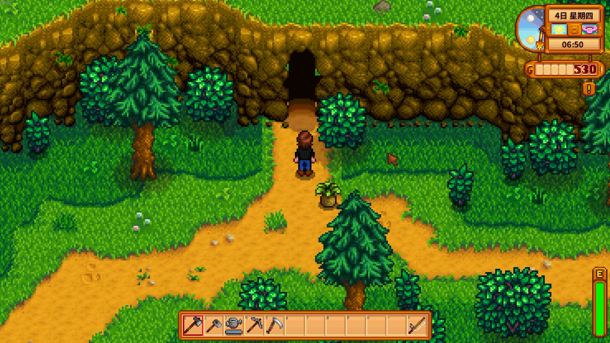

Inside the cave, players can battle and answer vocabulary questions to progress.

### Lake Hub

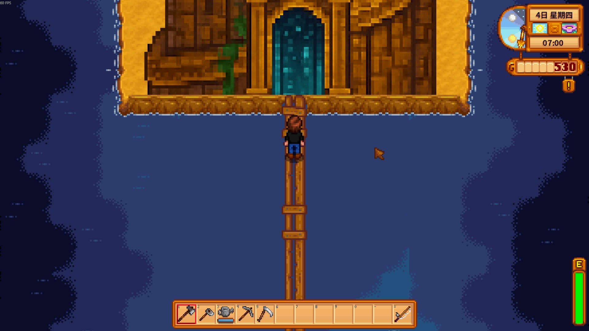

In the hub area, the top-left shows Knowledge Shards (the core currency).

You can choose a vocabulary book from default sets or your [custom vocabulary](#custom-vocabulary).

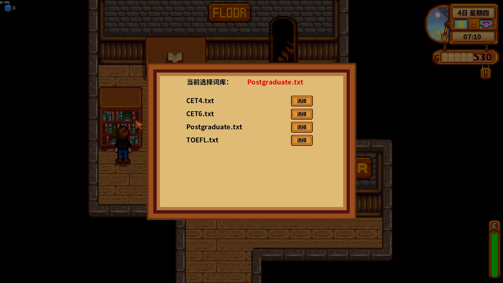

You can also enter the wrong-word review page (costs 10 shards):

Or unlock the cellar/utility area (costs 100 shards).

### Normal Floors

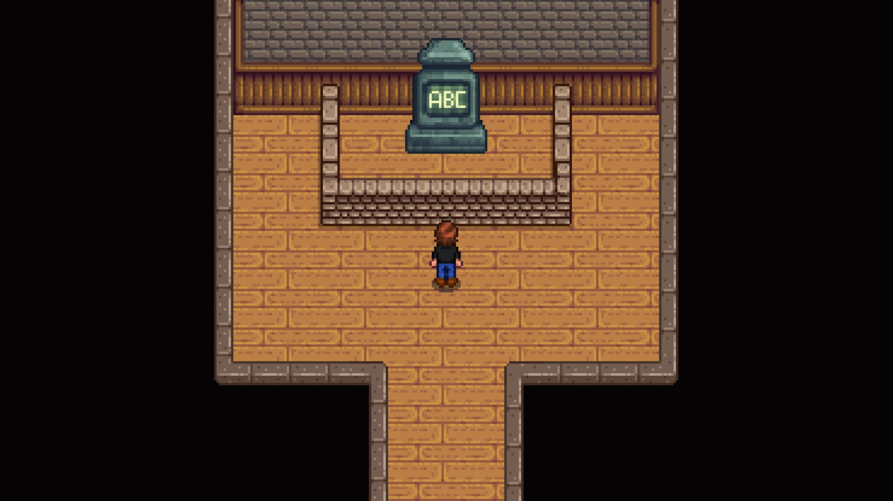

Break crystals to answer multiple-choice vocabulary questions. Correct answers clear progress.

- Correct answer: +2 Knowledge Shards
- Wrong answer: the word is added to the wrong-word set for later review

You can use keyboard number keys 1–4 for options.

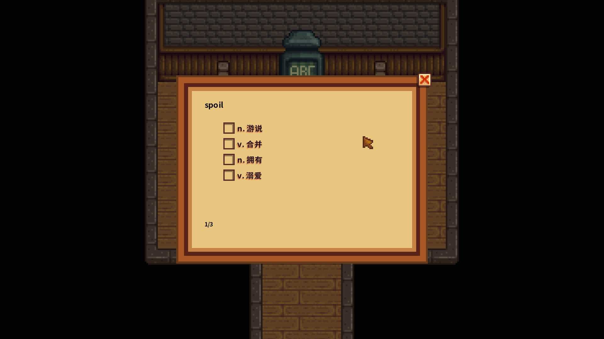

### Boss Floors

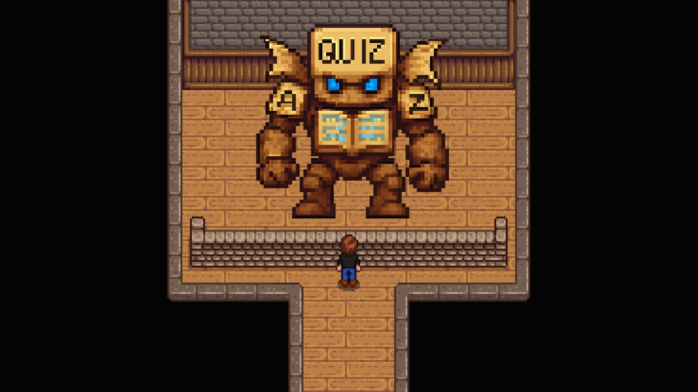

After enough learning progress, boss floors appear as review checkpoints.

- Questions come from learned-but-not-reviewed words.
- Passing boss floors marks those words as reviewed.

### Reward Floor

After defeating enough enemies or bosses, you can enter a reward floor and choose one reward card.

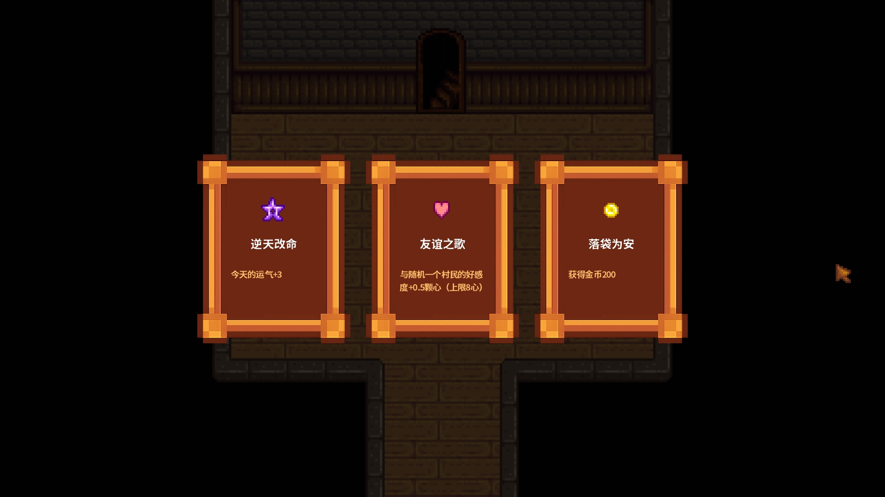

### Final Boss Area

After completing all vocabulary learning goals, you can challenge final boss NPCs in the cave's deepest area.

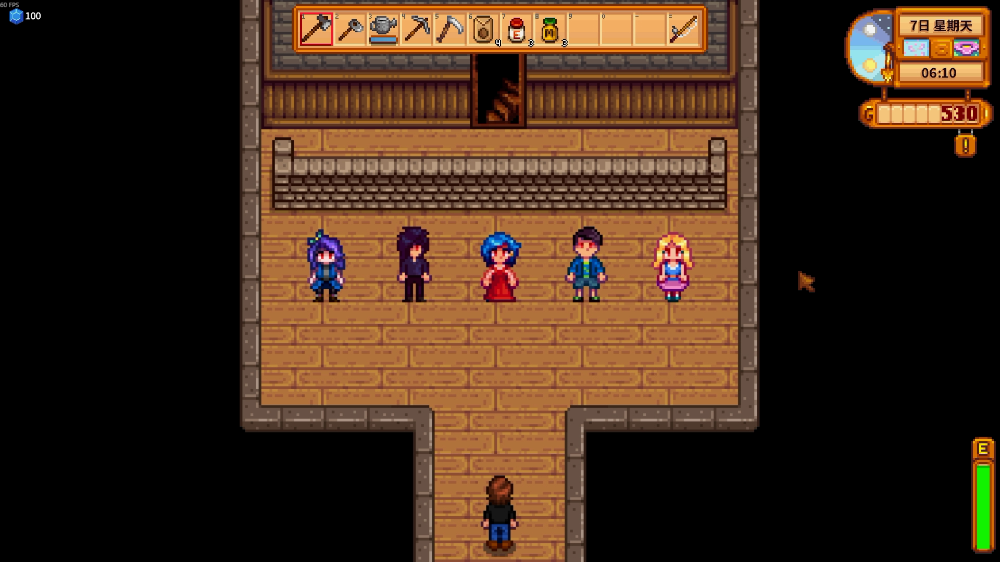

### Cellar

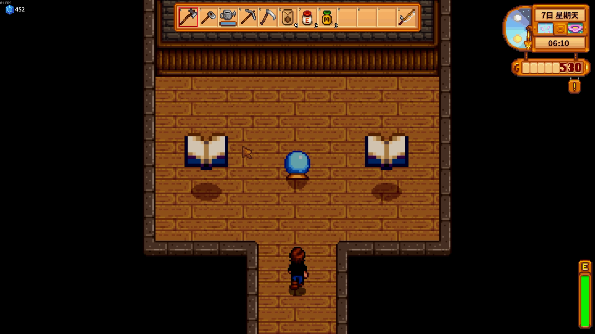

In the cellar, you can view statistics and configure gameplay settings.

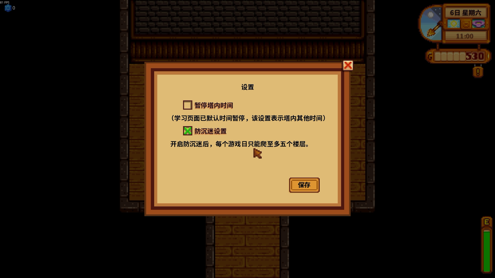

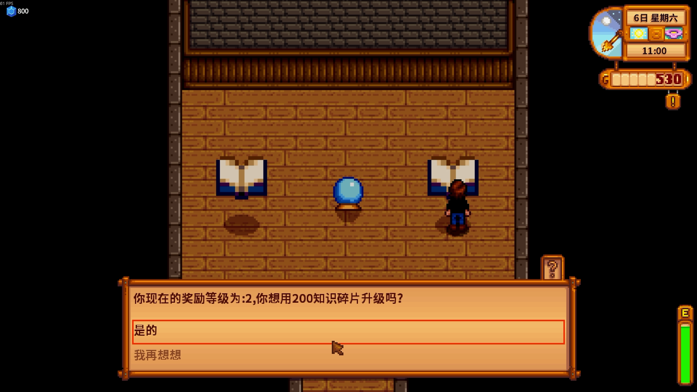

## Custom Vocabulary

You can place custom `.txt` files in `Mod/VocabValley/Vocabulary`.

Each line format:

`original<TAB>translation`

Use a real **Tab** character between columns (not spaces).

## FAQ

### Which languages can I learn?

Current design supports multiple language pair extensions. The default content focuses on Chinese ↔ English vocabulary.

### Why does my custom vocabulary fail to load?

Check:

- one word per line
- original term first, translation second
- separated by a real **Tab**

### Is it compatible with other mods?

Compatibility is not fully tested with all mods yet.

## Acknowledgements

Default vocabulary source:

https://github.com/KyleBing/english-vocabulary