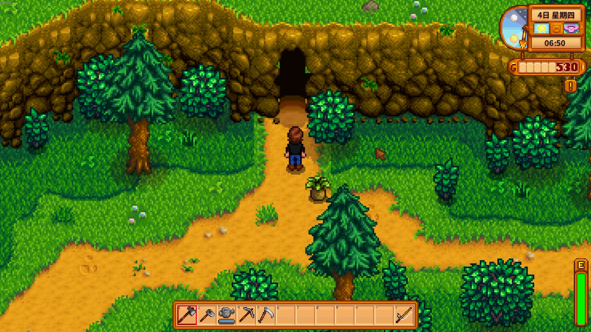

# VocabValley

> So it was named Babel, because there the Lord took away the sense of all languages and from there the Lord sent them away over all the face of the earth.

**English Version**

VocabValley 是一个[星露谷物语](https://www.stardewvalley.net/) 游戏的玩家自制Mod，该Mod添加了一处新场景――巴别塔，玩家可以在该塔内学习英语单词并根据进度获得相应奖励。

## 开始

### 安装所需前置模组

该Mod依赖于以下前置模组：
- [SMAPI](https://smapi.io/)
- [Content Patcher](https://www.nexusmods.com/stardewvalley/mods/1915)

### 安装该模组

1. 找到您的游戏文件夹
2. 从[Nexus Mods](https://www.nexusmods.com/stardewvalley/mods/36259)或[Github](https://github.com/SocietyNiu/VocabValley/releases/tag/v1.0.0)下载VocabValley的最新发行版，压缩包将包括VocabValley与VocabValley.content两个文件夹，分别为Mod代码部分和内容托管部分
3. 将获得的两个文件夹放置在游戏文件夹的`Mods`目录下

### 启动游戏

当你在进入存档后看见SMAPI控制台显示

>[XX:XX:XX INFO  VocabValley] 成功加载 XX 条单词

则说明词库导入成功。

## 游戏介绍

如果Mod被正确安装，当你来到边远森林时会看到一个山洞入口。

进入山洞后，小岛通过桥梁连接巴别塔，点击大门即可进入巴别塔。

### 第一层

在巴别塔塔内，左上角显示了玩家知识碎片的数量。知识碎片的获取方式和用途参见后文。

巴别塔左下部的书架负责词库选择，你可以点击书架选择预置词库或[自定义词库](#customVocab)。第一次启动游戏，默认将选择Mod/VocabValley/vocabulary下的CET4.txt词库。 

巴别塔上侧的桌子负责错题管理，你可以点击桌子上的书本回顾答错的单词。错题库需要10个知识碎片解锁。

巴别塔右下侧的入口是[地下室](#cellar)，需要100个知识碎片解锁。

巴别塔背景处的大门是爬楼的入口，当你进入后，你会被传送到普通楼层或Boss楼层。

### 普通楼层

普通楼层存在单词石碑，石碑上有若干问题，你必须选择正确所有的选项才能通过该层。

注意：如果你在回答问题时选择了错误的选项，那么该题将会被重新加入问题集尾部并需要你重新回答。

每次正确回答会给玩家2个知识碎片。

**你可以使用键盘上的1-4选择选项并使用回车或空格进入下一题**

> 普通层选词逻辑是，从词库中所有未学习的单词中挑选前10个

### Boss层

当你摧毁若干单词石碑后，你将在下一层进入Boss楼层，该楼层作为复习楼层，需要你回答之前所有已经学习过但还未复习过的单词。在Boss楼层，除了英文题目中文选项，还有中文题目英文选项的题目，这两种题目将会随机出现。

> Boss层进入逻辑是，当目前累计已学习但未复习的单词达到30个，则进入Boss楼层。对于在Boss层答错的单词，将会标记为"未学习"状态并重新在未来普通层出现。

### 奖励层
当你打败单词守护者后，你将进入奖励楼层，奖励楼层会随机出现三种卡牌奖励，你只能在其中选择一种。你可以通过知识碎片刷新卡牌奖励。

### 最终Boss层

当你学习完全部单词后，你将进入最终Boss层，面对五位黑化村民的试炼。

> 该处村民仅为贴图，不影响镇上村民正常活动

五位村民的试炼分别为

| NPC      | 试炼 |
| ----------- | ----------- |
| 阿比盖尔      | 回答错题频率前50的单词并保持正确率在80%以上       |
| 塞巴斯蒂安   | 从全部错题中任意抽取50个，在200秒内回答完毕并保持正确率60%以上 |
| 艾米丽   | 从全部词库中任意抽取20个，全部回答正确      |
| 谢恩   | 从全部词库中任意抽取50个，在200秒内回答完毕并保持正确率70%以上 |
| 海莉   | 从全部词库中任意抽取120个，在960秒内回答完毕并保持正确率90%以上 |

当你依次通过五位村民的试炼，你将来到巴别塔的塔顶并获得最终奖励。

### 地下室

地下室最左侧悬浮的书，记录了玩家的统计信息。

地下室中间的魔法水晶，用于塔内的设置。

地下室最右侧悬浮的书，可以用来升级楼内的奖励水平，升级后，击败Boss的奖励将更加丰富。

## 自定义词库

你可以在Mod/VocabValley/vocabulary中添加自己的词库，词库目前是`.txt`格式，每行一个单词，原文在前，译文在后，**中间由Tab键分隔**。注意，由于空格键和Tab键显示方式相似，需要进行分辨，详细可参考文件夹中的预置词库。

**目前存档管理方式采用词库名和背词进度一一对应模式，因此，如果仅对词库进行修改可能造成进度出现问题。建议使用不同名称进行词库命名。**

## 常见问题

### 我可以学习其它语言吗

目前测试结果Mod支持法语、德语、西班牙语等特殊字符，不支持日语、韩语等

### 为什么我的自定义词库出现问题

请依据以下步骤进行自检

- 是否一行仅一个单词
- 是否原文在前、译文在后
- 原文和译文中间是否以**tab**键分隔

### Mod和其它Mod冲突吗

目前没有测试，如果有冲突请联系作者

## 感谢

预置词库原作者 https://github.com/KyleBing/english-vocabulary

