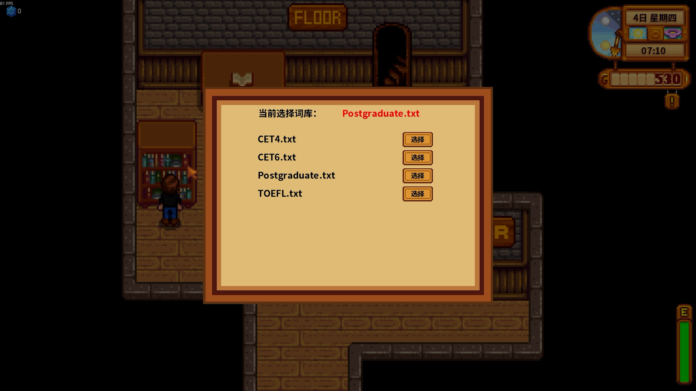
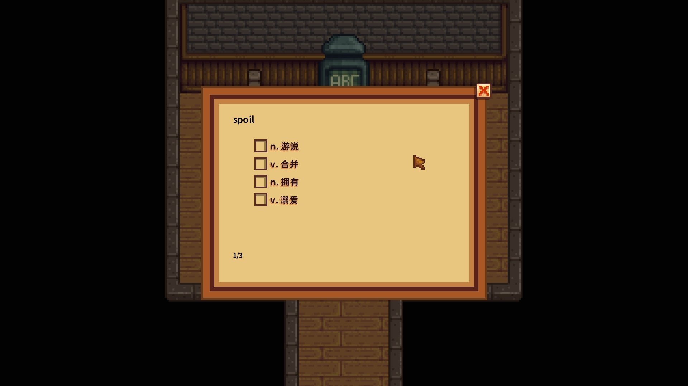
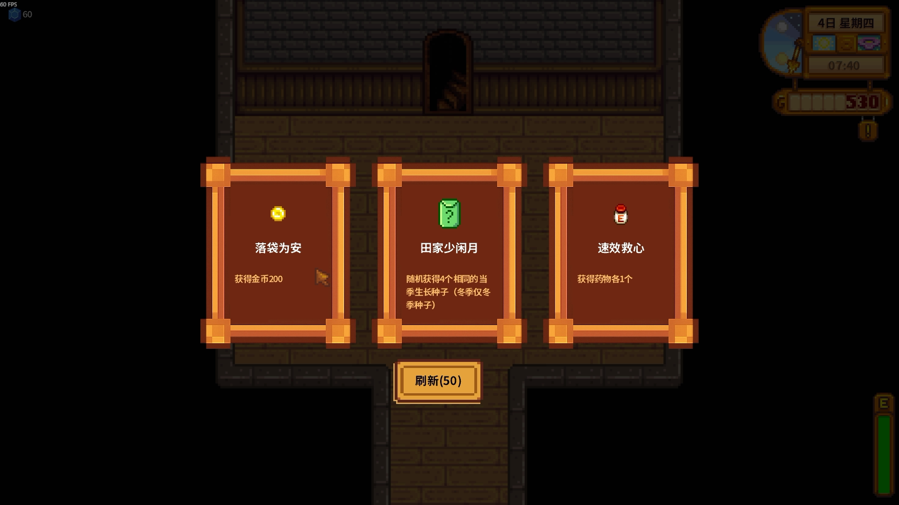

# VocabValley

> So it was named Babel, because there the Lord took away the sense of all languages and from there the Lord sent them away over all the face of the earth.

VocabValley 是一个[星露谷物语](https://www.stardewvalley.net/) 游戏的玩家自制Mod，该Mod添加了一处新场景――巴别塔，玩家可以在该塔内学习英语单词并根据进度获得相应奖励。

## 开始

### 安装所需前置模组

该Mod依赖于以下前置模组：
- [SMAPI](https://smapi.io/)
- [Content Patcher](https://www.nexusmods.com/stardewvalley/mods/1915)

### 安装该模组

1. 找到您的游戏文件夹
2. 从Nexus Mods或Github下载VocabValley的发行版，这将包括VocabValley与VocabValley.content两个文件夹，分别为Mod代码部分和内容托管部分
3. 将获得的两个文件夹放置在游戏文件夹的`Mods`目录下

### 启动游戏

第一次启动游戏，默认选择Mod/VocabValley/vocabulary下的CET4.txt词库，当你在进入存档后看见SMAPI控制台显示

>[XX:XX:XX INFO  VocabValley] 成功加载 XX 条单词

则说明词库导入成功。

如果Mod被正确安装，当你来到边远森林时会看到一个山洞入口

进入山洞后，小岛通过桥梁连接巴别塔，点击大门即可进入巴别塔。

巴别塔左下部的书架负责词库选择，你可以点击书架选择预置词库或自定义词库。

巴别塔上侧的桌子负责错题管理，你可以点击桌子上的书本打开错题库。

巴别塔背景处的大门是爬楼的入口，当你进入后，你会被传送到普通楼层或Boss楼层。

普通楼层存在单词石碑，石碑上有若干问题，你必须选择正确所有的选项才能通过该层。注意：如果你在回答问题时选择了错误的选项，那么该题将会被重新加入问题集尾部并需要你重新回答。

当你摧毁单词石碑后，你将在下一层进入Boss楼层，该楼层作为复习楼层，需要你回答之前所有已经学习过但还未复习过的单词。在Boss楼层，除了英文题目中文选项，还有中文题目英文选项的题目，这两种题目将会随机出现。

当你打败单词守护者后，你将进入奖励楼层，奖励楼层会随机出现三种卡牌奖励，你只能在其中选择一种。

当你学习完所有单词后，你将面临最终Boss，击败他你将获得强劲的永久奖励，该功能还在开发中……

## 待开发功能：
- 更加丰富的奖励机制
- 统计功能
- 防沉迷机制
- 时间暂停及爬塔设置
- 积分、奖励层和知识商人
- 多人联机
- 适配手柄

## 自定义词库

你可以在Mod/VocabValley/vocabulary中添加自己的词库，词库目前是`.txt`格式，每行一个单词，原文在前，译文在后，**中间由Tab键分隔**。注意，由于空格键和Tab键显示方式相似，需要进行分辨，详细可参考文件夹中的预置词库。

目前尚未开发针对某一词条的换行功能，因此最佳实践为控制译文长度在较短的范围内。